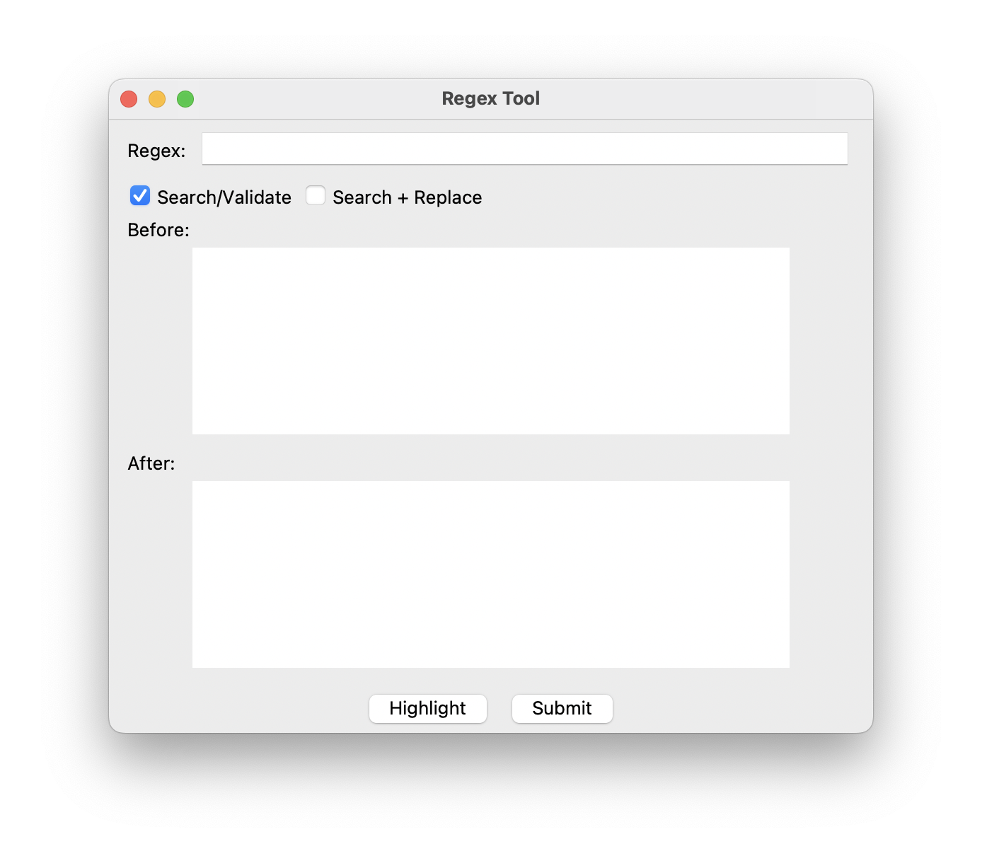

# State of Automatic Regular Expression Generation: Testing the Viability of Brute Force Approach

**John Kim** — Occidental College

[Full paper (PDF)](paper.pdf)

---

## User Interface

 

---

## Abstract

Regular expressions are an irreplaceable tool in computer science. However, regular expressions are not only difficult to write correctly but also difficult to test correctly. In fact, 80% of regexes are implemented without any testing.

Automatic regex generation poses a fascinating alternative but has proven difficult for the field. This paper summarizes the state of automatic regex generation and tests the viability of a brute force approach to the problem. With user-provided keywords, the system converts the keywords into simplified regex tokens and uses a brute force algorithm to complete the regular expression. The results are limited. The system is capable of handling shorter regex solutions but cannot handle longer and more complex regexes due to the exponential increase of the search space.

Though this paper does not conclusively disprove the viability of the brute force approach, the paper highlights its fundamental limitations within this field.

---

## Introduction

To say that automatic regular expression generation is a multifaceted field would be an understatement. It is a convoluted maze of regular expression theory, machine & deep learning, software engineering, computer security, and more. It is a maze so complex that many paths are yet to be explored.

The goal is to generate a correct regular expression to the specifications provided by the user. But there exists an unknown number of correct regexes within an incalculably vast solution space and reliably checking correctness in either theory or application is yet to be possible. The diversity of regex use-cases make generalization highly limited.

The field has entertained many approaches to the problem. Machine and deep learning methods have been most promising, specifically evolutionary and NLP approaches. But even they lacked reliability and generalizability.

The inherent, pesky problem is that regex correctness is not simply syntactic. An expression can be syntactically valid but fail semantically or require an absurd amount of compute to execute. The problem of automatic regular expression generation exists within three entangled dimensions—syntactic, semantic, and computational. Syntactic challenges were easily addressed with compilers and static analysis tools. Computational challenges could be addressed in future research with the recent advancements of linear time regex engines: the field has yet to respond. Semantic challenges are by far the most limiting due to the vast diversity of use-cases of regular expression.

This paper also tests the viability of a baseline brute force approach to the problem. The results are limited—the algorithm reliably generates compact regular expressions but cannot generate longer expressions. The fundamental issue is the blind search. Since there is no feedback mechanism, as the token count increases linearly, the search space grows exponentially.

---

## Technical Background

### Theory of Regular Expressions

In 1956, the mathematician Stephen Kleene first introduced the concept of "regular events" and their notations, today it is known as regular expressions. Kleene's work established that a language is regular if and only if it can be written in regular expression notations and is accepted by finite automaton.

Fundamentally, regex standards are built from three alphabetical operations: concatenation, alternation, and the Kleene star. Concatenation is `ab` matching with the string `a` if it is suffixed by `b`. Alternation is `a|b` matching `a` or `b`. Kleene star is `a*` matching repetition, if any, of `a`. All other common regex notations are all a variation of these 3 foundations.

Today, most regex engines have developed capabilities outside of these 3 foundational operations, such as backreferences and lookaheads. These new features—although useful—exist beyond the elegantly simple foundations and come at a computational cost. These are key factors of regex vulnerabilities such as Regex-based Denial of Service (ReDoS) attacks.

### Byte Pair Encoding

Byte Pair Encoding (BPE) is a tokenization algorithm that identifies the most common adjacent characters in a corpus. The BPE algorithm was used on a HuggingFace corpus of non-synthetic regular expressions to identify common regex pairs.

However, BPE is used in the context of NLP and is misaligned with the language of regular expression. Most regex characters hold distinct syntactic meaning individually and should not have been paired with its neighbors: `^` `$` `+` `?` `|`. Also, BPE fundamentally depends on a large and redundant corpus to identify meaningful patterns. Regular expression corpora, unlike NLP corpora, are too limited for this approach; this limitation undermines the statistical foundation of the BPE algorithm.

A majority of the output were of no significance and required manual filtering. Nonetheless, the BPE algorithm did successfully find some pairs of regex significance such as `.*` and `\d`.

### Regex-based Denial of Service (ReDoS)

Regex-based Denial of Service (ReDoS) is a DoS attack caused by algorithmic complexity that drains a given web-service's resources with high time complexity. The time complexity can grow exponentially or even polynomially as its input size increases linearly.

Most regex functions have an exponential time worst-case complexity. But worst-case complexities are rarely triggered with genuine inputs and are easily overlooked. ReDoS failures occur when such regex function is given a maliciously crafted input or a genuine input that inadvertently triggers exponential/polynomial backtracking. Programming languages predominantly use backtracking for their regex search algorithm, most notable examples are C#, Java, JavaScript, and Python. Its computational cost is negligible in most use cases but can be detrimental.

There are numerous ways to write a regular expression that gives identical outputs. A regex generated by the brute force algorithm may be of theoretical soundness but may also be computationally catastrophic. Davis' paper found over 4,000 unique super-linear regexes across the npm and PyPI ecosystems alone, affecting over 10,000 modules. This left many notable projects such as Django, Hapi, and MongoDB vulnerable. ReDoS vulnerabilities are common, yet their dangers are underappreciated. Staicu and Pradel found that of the 2,846 real-world Express-based websites, 339 were vulnerable to ReDoS attacks. Since Node.js uses a single-threaded execution model, a malicious request can block the entire server.

#### Case Study: 2019 Cloudflare Outage

Sometimes a regular expression function can cause a ReDoS failure even with genuine inputs. One such example is the 2019 Cloudflare global outage. Cloudflare is a company that provides a number of internet services, one of which is Content Delivery Network (CDN) services. To combat Cross-site Scripting attacks through their CDN, they implemented a regular expression to their firewall that detects any JavaScript and HTML code embedded in URLs.

```
(?:(?:\"|'|\]|\}|\\|\d|(?:nan|infinity|true|false|null|undefined|symbol|math)|\`|\-|\+)+[)]*;?((?:\s|-|~|!|{}|\|\||\+)*.*(?:.*=.*)))
```

The malformed section that caused the outage was `.*(?:.*=.*)`. Disregarding the non-capturing group `(?:)`, we are left with:

```
.*.*=.*
```


*Exponential time complexity of Cloudflare's malformed regex*

As the simplified regex shows, the first two `.*` will match greedily and then both would backtrack iterating backwards one unit at a time until it finds an equal-sign or until all possibilities are exhausted. This means that it will take 23 steps to match an input string as simple as `x=x`. 33 steps for `x=xx` and 45 for `x=xxx`. The complexity is exponential and much worse if the string does not contain an equal-sign as it would need to exhaust all possible combinations of the two `.*`. For instance, it will take 4,067 steps to compute a string that is 20 characters long without an equal-sign. Considering how long URLs can get, it is evident how it caused the outage.

The outage demonstrates the disastrous potential of ReDoS failures and how inconspicuous they can be to developers.

#### Linear Time Regular Expression

Since the 2019 outage, Cloudflare has switched to the Rust regular expression engine. The Rust engine is deterministic and runs in linear time: O(N).

Deterministic regular expressions such as re2 and the Rust regex engine achieve linear time complexity by utilizing a combination of Deterministic Finite Automata (DFA) and Non-Deterministic Finite Automata (NFA), allowing them to avoid backtracking. A significant downside is the high memory requirements for complex regular expressions.

It is recommended to use a linear time engine when testing the regex outputs. It is possible for the brute force algorithm to generate a regular expression with exponential or polynomial time worst-case complexity.

---

## Prior Work

Regular expressions are a widely used tool in essentially all programming languages. It is most useful for input validation, text processing, and pattern matching. Despite the widespread adoption, writing or testing a regex is quite difficult. Research shows that about 80% of regexes implemented in real projects are completely untested.

Automating regex generation could alleviate this issue and machine & deep learning models (evolutionary and NLP approaches) have shown to be promising. This section summarizes the state of the field.

### Evolutionary Algorithm

The Bartoli paper used labeled training examples to automatically generate regular expressions with an evolutionary algorithm. The user inputs strings annotated with the target substrings. Then the program evolves its regular expression with a fitness function that benchmarks regex length and Levenshtein distance. Their program was evaluated on 12 extraction regex tasks—such as email addresses, IP addresses, URLs, and phone numbers—and averaged about 90% on precision and recall with only 50 training examples. Considering the vast use-cases of regular expression, the system is highly limited in generalizability. Nevertheless, it is not an insignificant achievement and proves the viability of the evolutionary approach. Also, the system reliably outputted regexes, regardless of length. Though it did require up to 42 minutes of compute, the experiment was done with unusually limited hardware: 4 machines running in parallel with quadcore Intel Xeon X3323 (2.53 GHz) and 2 Gbytes of RAM with no GPU. Modern hardware would allow more generations and iterations of the evolutionary algorithm.

Notably, the program only used possessive quantifiers, completely discarding greedy and lazy quantifiers, to avoid exponential/polynomial backtracking. This is a crude solution that limits the range and quality of the regex outputs. But the paper was published in 2014. Future research could take advantage of the recent advancements in linear time regular expressions—utilizing tools such as the Rust regex engine or re2—to address this issue without compromising the system.

### Natural Language Processing

The bottleneck of the Natural Language Processing (NLP) approach for automatic regular expression generation is the training data. Writing regular expressions is a specialized skill that crowdsource workers most often do not have. This leads to high-quality, large-scale, human regex generation and annotations becoming prohibitively expensive.

The 2013 corpus from Kushman and Barzilay (KB13) is a small, human-made corpus with pairs of regular expressions and their corresponding natural language descriptions. But it is not without significant flaws. The natural language descriptions were written by crowdsource workers with no background in programming and their corresponding regular expressions were written separately by hired programmers, leading to a fundamental disconnect between the two. Furthermore, it was later found that KB13 contained significant duplicates with only 45% of the corpus containing unique regexes. The quality of this decade-old corpus is poor and outdated, but no suitable alternative exists.

Deep-Regex, developed by Locascio et al., is an NLP system with a sequence-to-sequence Long Short-Term Memory (LSTM) model. It engages the task as a machine translation problem, aiming to convert a natural language description directly into a regular expression. It was trained purely on a synthetic corpus of 10,000 pairs of regular expressions and descriptions, and was given no domain-specific knowledge. When tested against the human generated corpus, KB13, it achieved 65.6% accuracy. Although the limitations of KB13 undermine the result, this is an impressive result considering their corpus was entirely synthetic. The Locascio paper has successfully demonstrated the viability of an NLP approach to automatic regex generation. Future research could take advantage of recent advancements in Large Language Models (LLMs) for large-scale generation of higher-quality synthetic descriptions on real-world regexes.

### Regular Expression Verification

Automatic Checking of Regular Expressions (ACRE), given a regex, checks for 11 common regex mistakes programmers make. It works by converting the input regex into a specialized acyclic Non-deterministic Finite Automaton (NFA) and traversing it to find paths, applying checkers to each path. When tested on 826 regular expressions, it found issues with 283 regexes with 94 known false negatives and 46 false positives.

| Checker | Applied To | Example | Fix |
|---|---|---|---|
| Bad Range | Character Set | No | Yes |
| Separator in Character Set | Character Set | Yes | Yes |
| Duplicate Character | Character Set | No | No |
| Lone Brace in Character Set | Character Set | Yes | No |
| Optional Brace | Path | Yes | No |
| Duplicate Punctuation Only Character Set | Path | Yes | No |
| Wildcard Next to Punctuation | Path | Yes | Yes |
| Repeat Punctuation | Path | Yes | No |
| Digit Too Optional | Path | Yes | No |
| Anchor in the Middle | Path | Yes | No |
| Consistent Anchor Usage | Set of Paths | Yes | Yes |

Checking regex correctness is an inherently difficult problem. Regex syntax is highly compact and abstract, making error detection frustratingly difficult for both developers and automated systems. Most methods rely on labeled examples, natural language specifications, or domain knowledge. No single method has proven to be reliable across the vast use cases of regular expression. The problem remains unsolved.

---

## Methods


*Program overview*

### Keyword Pre-Processing


*Keyword pre-processing examples*

Keyword pre-processing is a process that consolidates the keywords into compact expressions and is implemented before the brute force algorithm.

This works in two passes. First, any keywords that share a common three-character prefix gets compared and merged. The program finds where they diverge and combines them into one regex. For example, `guppies` and `guppy` become `gupp(ies|y)`. If one of the keywords already has a regex group in it, the program takes apart the existing parts and merges everything together. Second, any keywords that only differ in capitalization of the first letter gets merged: `guppy` and `Guppy` become `[Gg]uppy`.

The process makes the critical assumption that a correct regular expression can be found by applying the same rules and operations to all keywords indiscriminately.

### Token Vocabulary

There are 2 token lists. The short list contains the most common regex tokens identified with BPE on a corpus of real-world regular expressions and manual filtering. This compiled tokens such as `.*`, `\d`, and `[a-z]`. The longer list contains every standard regex operator. It serves as a backup for the system if the short list proves insufficient.

### Token Count Sampling

The program randomly samples the number of tokens used in each search. For the first 10,000, the token count is drawn from a normal distribution centered at 3 with a standard deviation of 1. Most regular expressions are short, so this focuses the early search there. Between the 10,000th and 20,000th searches, the standard deviation is increased to 2. Past 20,000, it is just sampled randomly between 0 and 10: the distribution is pretty much just flat by this point. Any regex that requires more than 10 tokens is outside the scope of this paper.

This method gives statistical preferential treatment towards regular expressions with lower token counts, albeit non-linearly.

### Brute Force Search

In each iteration, the tokens are chosen at random adhering to the token count. The keywords are then plugged in with random digits as necessary. Then the candidates' syntactic validity is checked with Python's `re.compile`, though this step appears to be unnecessary as it always returns syntactically valid. This is due to the keyword pre-processing handling the keyword conversion to regex.

The brute force nature of the algorithm is ultimately why the results are limited: lacking any feedback from the guesses, the algorithm is blindly guessing.

---

## Evaluation Metrics

The algorithm was evaluated with two metrics, the average time and number of attempts. Considering the brute force search, there is no convergence, ergo accuracy is not an important metric. The question is not if it can find the answer—since it eventually always will, given no keyword rule conflict—but how quickly it can find it. Time and attempts capture how effective the algorithm was.

Each test was conducted 10 times and then averaged to minimize the effects of outliers. The four targets were selected to test the program's ability to handle keywords. `^(John|Han|Luke|Leia)$` tested basic keyword alternation with no overlaps. The guppy regexes tested the keyword handling more thoroughly, requiring the program to address capitalization and suffix variations.

A mediocre outcome would be the algorithm outputting a correct regular expression at all. A good outcome would be the algorithm consistently outputting short regexes within a minute. A great outcome would be the algorithm outputting a correct regex for longer, complex regexes at all.

---

## Results and Discussion

| Regex (Increasing Complexity) | Avg. Time (s) | Avg. Attempts |
|---|---|---|
| `^(John\|Han\|Luke\|Leia)$` | 0.05 | 4,435 |
| `\d[Gg]upp(ies\|y)?$` | 1.37 | 126,026 |
| `^d[Gg]upp(ies\|y)?$` | 28.33 | 2,610,318 |
| `\b\D[Gg]upp(ies\|y)?\b` | 37.57 | 3,389,479 |

*Average of 10 trials*

The algorithm was able to consistently and quickly output compact regular expressions. The simplest target with two regular expression tokens `^(John|Han|Luke|Leia)$` was found in an average of 0.05 seconds in under 5,000 attempts.

The high search efficiency was achieved thanks to the keyword pre-processing. Because of it, the regular expression could be completed with only 2 tokens: `^` and `$`. The more complex guppies, on the other hand, took more time and attempts. The guppy outputs required about 28 to 38 seconds and about 2.6M to 3.4M guesses, excluding `\d[Gg]upp(ies|y)?$` which only required on average 1.37 seconds and 126K guesses. This can be attributed to the BPE process identifying `\d` as a common token combination, which allowed the regular expression to be formed with only 3 tokens instead of 4.

Notably, the exponential increase in search space as the token count increases linearly demonstrates the current algorithmic limitations in being scaled. The lack of a feedback mechanism is also causing high variation in time complexity for each trial. The algorithm simply could not consistently output longer and more complex regular expressions within a reasonable time frame.

This is a fundamental limitation of the brute force approach. The inherent issue is the blind search. Since increasing the token count linearly increases the search space exponentially, no approach will be able to compensate for the exponential increase in computational cost. The exponential increase in the search space can be avoided with guided search. Though the brute force approach shows promise in handling short and simple regular expressions, it is fundamentally incapable of handling longer and complex ones.

The keyword pre-processing does meaningfully minimize the search space, which is exemplified by the fact that `^(John|Han|Luke|Leia)$` was found in about 4,500 attempts while `\b\D[Gg]upp(ies|y)?\b` needed 3.4 million. Though a neat and novel improvement to the approach, it obviously cannot aid in generating complex rules and operations.

The aforementioned limitations are highlighted by the success of machine and deep learning approaches in the field. Genetic and NLP approaches both utilized a feedback mechanism that the brute force approach—by definition—cannot, and they both have been far superior in testing. The results of this paper point towards a lower bound in the field: blind search cannot be used for automatic regular expression generation other than for compact regular expressions. Any viable approach—for a generalized solution—must be guided.

---

## Ethical Considerations

The risk of Regular Expression Denial of Service (ReDoS) failure is of significant ethical concern. The program cannot check if the generated regex is computationally safe, it only checks if it is syntactically valid. The system was developed purely for research purposes and should not be deployed in any real-world environments. It especially should not be used in any security-critical applications such as input validation or firewall rules. For future research, it is recommended that the generated regular expressions are only tested and implemented in a linear-time engine such as the Rust regex engine or re2.

---

## Conclusion

The brute force algorithm, used in conjunction with keyword pre-processing, has shown to reliably generate compact regexes in testing. However, it failed to scale. The exponential growth of the search space could not be compensated for by the hardware—a fundamental limitation of a brute force approach.

The keyword pre-processing system could aid in future research. It meaningfully reduces the search space by consolidating keywords into their most compact regex representation. The method could be implemented as a pre-processing step in a system that utilizes a more promising approach.

The field of automatic regular expression generation has made limited but meaningful progress. Evolutionary and NLP approaches have shown the most promise. The evolutionary approach has demonstrated reliable extraction regex generation, even for complex expressions, from user-provided extraction targets but was limited by its lack of generalizability. The NLP approach demonstrated that the problem could be addressed as a machine translation problem and demonstrated its viability for generalized regex generation, but was ultimately limited by synthetic training data. The lack of a large, high-quality training dataset—regular expression and natural language description pairs—remains as the bottleneck in the NLP approach. As of research and writing, no approach has been even applicable, let alone reliable, across all regex use-cases.

In conclusion, this paper argues that any viable approach to the automatic regex generation problem must use some form of a guided search. This is an inherent requirement.

---

## Quick Start

```bash
pip install -r requirements.txt
python main.py
```

To replicate the benchmark results, open `random_generate.py`, set the `TARGET` and `KEYWORD` variables to your desired target, and run it. The program will collect the results of 10 trials and print each trial's time and attempts alongside the averages.

---

## Project Structure

| File | Description |
|---|---|
| `main.py` | Entry point — keyword processing + brute-force loop |
| `keywords.py` | Keyword pre-processing and merging |
| `tools.py` | Token vocabulary and regex validation |
| `math_stuff.py` | Truncated normal distribution for token count sampling |
| `regex_generator.py` | Standalone valid-regex generator |
| `random_generate.py` | Brute-force benchmark script (produces Table 2) |
| `BPEer.py` | BPE implementation used to identify common token pairs |
| `corpus.py` | Loads data.json and builds corpus.txt |
| `user_interface.py` | Tkinter GUI |
| `tests.py` | Test suite |
